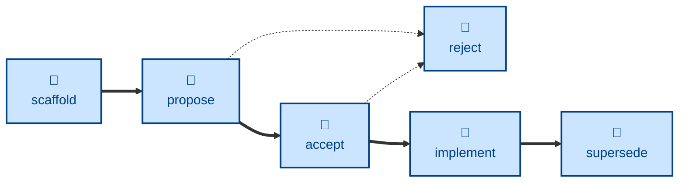

# Agent skills for managing Requests for Comments (RFCs)

The skills available to agents in this project are:

- **[scaffold-rfc](./scaffold-rfc/):** \
  Scaffolds a new RFC, ready for the user to complete.
  Sets the status to `DRAFT`.

- **[propose-rfc](./propose-rfc/):** \
  Handles the `DRAFT` → `PROPOSED` transition.

- **[accept-rfc](./accept-rfc/):** \
  Handles the `PROPOSED` → `ACCEPTED` transition.

- **[implement-rfc](./implement-rfc/):** \
  Handles the `ACCEPTED` → `IMPLEMENTED` transition.

- **[reject-rfc](./reject-rfc/):** \
  Handles the `PROPOSED` → `REJECTED` transition.

- **[supersede-rfc](./supersede-rfc/):** \
  Handles the `IMPLEMENTED` → `SUPERSEDED` transition.

The **scaffold-rfc** skill....

## Compatibility

These skills are compatible with the [Agent Skills](https://agentskills.io/)
convention. Most agent harnesses support this convention natively, but
workarounds may be required for harnesses that do not.
