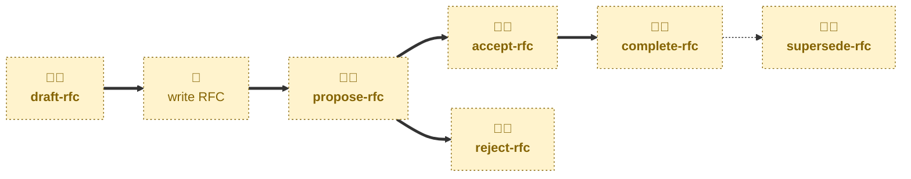

# Agent skills

The following skills are available to support the management of RFCs
via AI agents.

- **[draft-rfc](./draft-rfc/):** \
  Scaffolds a new RFC proposal, ready for the user to write up.
  Cuts an `rfc/<slug>` branch from `main`, prepares a fresh RFC from the
  template, opens a pull request in a draft state, and opens the discussion
  thread where review feedback will be gathered.
  Sets the status to `DRAFT`.

- **[propose-rfc](./propose-rfc/):** \
  Handles the `DRAFT` → `PROPOSED` transition.
  Checks the RFC is complete and takes the pull request out of draft, ready
  for stakeholder review.

- **[accept-rfc](./accept-rfc/):** \
  Handles the `PROPOSED` → `ACCEPTED` transition.
  Checks the approval gates and marks the RFC accepted, leaving the pull
  request open until the decision is implemented.

- **[complete-rfc](./complete-rfc/):** \
  Handles the `ACCEPTED` → `IMPLEMENTED` transition.
  Checks the tooling and infrastructure are in place and merges the RFC into
  the `main` trunk.

- **[reject-rfc](./reject-rfc/):** \
  Handles the `PROPOSED` → `REJECTED` transition.
  Rejects a proposed RFC and merges its document as a permanent record of
  the decision.

- **[supersede-rfc](./supersede-rfc/):** \
  Handles the `IMPLEMENTED` → `SUPERSEDED` transition.
  Retires an implemented RFC once a later, implemented RFC has replaced its
  decision.

## Workflow

The skills in this project are focused on the mechanics of managing the lifecycle
of RFCs.
For help putting forward an idea for discussion — researching the options and
writing up the RFC — you may instruct agents to use the
[**decide**](https://github.com/kieranpotts/skills/tree/latest/dev/skills/decide)
skill in my global skills collection.

## Compatibility

These skills are compatible with the [Agent Skills](https://agentskills.io/)
convention. Most agent harnesses support this convention natively, but
workarounds may be required for harnesses that do not.
