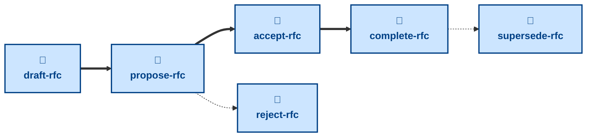

# Agent skills for managing Requests for Comments (RFCs)

The skills available to agents in this project are:

- **[draft-rfc](./draft-rfc/):** \
  Cuts an `rfc/<slug>` branch from `main`, prepares a fresh RFC from the
  template, and opens a pull request in a draft state.

- **[propose-rfc](./propose-rfc/):** \
  Checks the RFC is complete and takes the pull request out of draft, ready
  for stakeholder review.

- **[accept-rfc](./accept-rfc/):** \
  Checks the approval gates and marks the RFC accepted, leaving the pull
  request open until the decision is implemented.

- **[complete-rfc](./complete-rfc/):** \
  Checks the tooling and infrastructure are in place and merges the RFC into
  the `main` trunk.

- **[reject-rfc](./reject-rfc/):** \
  Rejects a proposed RFC and merges its document as a permanent record of
  the decision.

- **[supersede-rfc](./supersede-rfc/):** \
  Retires an implemented RFC once a later RFC has replaced its decision.

The **draft-rfc** skill opens a new RFC as a draft PR, ready for the user
to complete. After this step, **propose-rfc** puts the PR up for stakeholder
review. From there, **accept-rfc** or **reject-rfc** decides the RFC, and once
the tooling and infrastructure it calls for are in place, **complete-rfc**
lands it in the `main` trunk. An implemented RFC may later be retired with
**supersede-rfc** once a newer RFC replaces its decision.

These skills handle process, not substance: how an RFC is drafted, decided,
and landed in `main`. For the decision work itself — researching the options
and writing up the RFC — use the
[**decide**](https://github.com/kieranpotts/skills/tree/latest/dev/skills/decide)
skill in my global skills collection.

## Compatibility

These skills are compatible with the [Agent Skills](https://agentskills.io/)
convention. Most agent harnesses support this convention natively, but
workarounds may be required for harnesses that do not.
