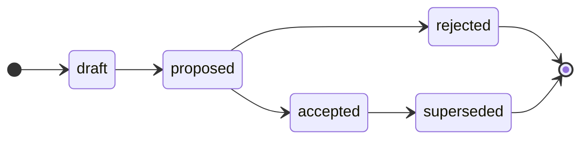

# [Project Name] — Requests for Comments (RFCs)

## Project overview

This repository holds the Requests for Comments (RFC) archive for [Project Name]: the permanent, chronological record of the project's significant _technical_ decisions — its architecture, its development and operations processes, and its choices of technology and tooling.

It is documentation, not code. There is nothing to build, lint, or run.

Product requirements (what the system does, in business terms) are recorded separately. This repository is concerned only with technical decisions (how the system is built and operated). Each RFC captures one decision: its motivation, the chosen solution, the alternatives considered, and the trade-offs.

## Repository structure

- `rfc/`: The permanent, append-only archive of every RFC, including rejected ones. Each RFC is a directory (`rfc/<category>/<slug>/`) holding its `README.md` and any supporting artifacts that back the proposal — e.g. architectural diagrams — grouped by category (`architecture`, `process`, `technology`, `tooling`). Keep such artifacts in the RFC directory (preferred) and link them from the document's `References` section. `rfc/TEMPLATE.md` is the starting point for a new RFC; `rfc/INDEX.md` is the numbered catalog.

## Rules

The capitalized words REQUIRED, MUST, MUST NOT, RECOMMENDED, SHOULD, SHOULD NOT, OPTIONAL, and MAY, in the context of this document and agent skills/instructions/rules, are to be interpreted as described in [IETF RFC 2119](https://www.ietf.org/rfc/rfc2119.txt).

- Write in American English.

- An RFC MUST be a single, atomic technical decision. Author it on an `rfc/<slug>` branch cut from `main`, and open a pull request titled `rfc: <slug>`.

- The default branch is `main`. An RFC is merged into `main` once it has been decided — `#accepted` or `#rejected`. A sequential RFC number is assigned at merge and recorded in `rfc/INDEX.md`; the number lives only in the index, and no RFC file is ever renamed.

- When the pull request is opened, it MUST be labeled with exactly one category — `ARCHITECTURE`, `PROCESS`, `TECHNOLOGY`, or `TOOLING` — matching the kind of decision. The category is denoted solely by this label; it is not duplicated in the RFC document.

- The current lifecycle state of an RFC is tracked via a lifecycle label on the PR. Apply the matching label (`#proposed`, `#accepted`, `#rejected`, `#superseded`) as the RFC advances. A pull request is opened as a GitHub draft while the document is still being refined; this draft state — not a label — represents work in progress, and the author marks the PR ready for review once it is ready for stakeholder review.

- Once an RFC is `#accepted` or `#rejected`, its document is immutable. Only its `Status` field, `Last updated` date, cross-references to related RFCs, and implementation trackers may change thereafter. An accepted RFC may only be superseded by another RFC. To change the _substance_ of a past decision, open a new RFC that supersedes it — do NOT edit the original.

- Never delete an RFC document, including rejected ones.

- The GitHub issue tracker is used only for maintenance work on this repository itself (via the `MAINTENANCE` template). RFCs are proposed, decided, and archived entirely through pull requests. Every RFC pull request MUST have an associated discussion thread, opened when the PR is opened (even as a draft) and used for all review feedback; the thread is closed when the RFC is accepted or rejected.

## RFC lifecycle

Each RFC moves through a defined state machine. From `proposed` onward, the current state is shown by a lifecycle label on the pull request; before that, the RFC is simply an open draft pull request.

- **Draft** — being written. The pull request is a GitHub draft carrying only its category label (there is no `#draft` label). Not yet ready for review.
- **Proposed** — complete and open for a decision. The pull request is marked ready for review and labeled `#proposed`, then reviewed and negotiated with stakeholders.
- **Accepted** — approved. Its number is recorded in `rfc/INDEX.md`, the discussion thread is closed, and the document is merged into `main`. An accepted decision stays in effect until a later RFC supersedes it.
- **Rejected** — not taken forward. Recorded in `rfc/INDEX.md` and merged into `main`, preserved permanently as the record of the decision and its rationale.
- **Superseded** — a previously accepted decision that a later, accepted RFC has replaced. This is the only state reachable from `accepted`.

The proposer drives an RFC up to `proposed`; only maintainers may take the decision transitions (`accepted`, `rejected`, `superseded`). Each transition has a skill that verifies its own gates and applies the matching label.

| From | To | Skill | Condition |
| --- | --- | --- | --- |
| _(new RFC)_ | `draft` | [`draft-rfc`](.agents/skills/draft-rfc/SKILL.md) | A draft pull request is opened with the scaffolded document and a category label. |
| `draft` | `proposed` | [`propose-rfc`](.agents/skills/propose-rfc/SKILL.md) | Document complete and free of template boilerplate; PR marked ready for review and labeled `#proposed`. |
| `proposed` | `accepted` | [`approve-rfc`](.agents/skills/approve-rfc/SKILL.md) | Stakeholder review and final-comment period concluded; `Depends on` RFCs accepted; decision approved; number added to `INDEX.md`; discussion closed; merged. |
| `proposed` | `rejected` | [`reject-rfc`](.agents/skills/reject-rfc/SKILL.md) | Stakeholder review concluded; decision not approved; number added to `INDEX.md`; discussion closed; merged as record. |
| `accepted` | `superseded` | [`supersede-rfc`](.agents/skills/supersede-rfc/SKILL.md) | A later, accepted RFC has replaced this decision, with reciprocal `Supersedes` / `Superseded by` links. |

Transitions not listed are not permitted: a decision MUST NOT move backwards or skip states. Once `accepted` or `rejected`, the document is immutable except for its `Status` field, `Last updated` date, cross-references to related RFCs, and implementation trackers.

## Skills

The [`.agents/skills/`](.agents/skills/) directory provides on-demand skills for managing the RFC workflow — one per state transition. Each skill carries the gate rules for its own transition; there is no separate audit skill.

- [`draft-rfc`](.agents/skills/draft-rfc/SKILL.md): scaffold a new RFC, open it as a draft PR, and open the associated discussion thread.
- [`propose-rfc`](.agents/skills/propose-rfc/SKILL.md): `draft → proposed` — verify the document is complete, then remove the PR's draft status and apply `#proposed`.
- [`approve-rfc`](.agents/skills/approve-rfc/SKILL.md): `proposed → accepted` (also closes the discussion thread).
- [`reject-rfc`](.agents/skills/reject-rfc/SKILL.md): `proposed → rejected` (also closes the discussion thread).
- [`supersede-rfc`](.agents/skills/supersede-rfc/SKILL.md): `accepted → superseded`.
