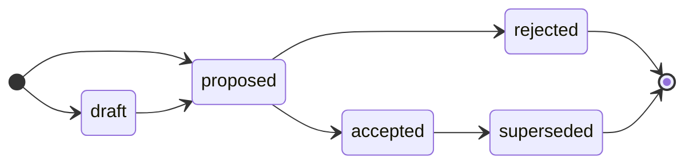

# Contributing

<!-- Agents MUST read ./AGENTS.md. This document is for humans. -->

Anyone with write access to this repository may propose a technical decision by opening an RFC. The project maintainers are responsible for shepherding RFCs through their lifecycle and for keeping the archive in good order.

## Rules

The capitalized words REQUIRED, MUST, MUST NOT, RECOMMENDED, SHOULD, SHOULD NOT, OPTIONAL, and MAY, in the context of this document and agent skills, are to be interpreted as described in [RFC 2119](https://www.ietf.org/rfc/rfc2119.txt).

- Write in American English.

- An RFC is the record of a decision. The [`rfcs/`](./rfcs/) directory is an append-only log. Once an RFC is `ACCEPTED` or `REJECTED`, its document is immutable, and only its status may change thereafter.

- An RFC MUST be a single, atomic decision. Author it on an `rfc/[description]` branch cut from `main`, and open a pull request titled `rfc: [description]`. A GitHub issue (labelled `ARCHITECTURE`, `PROCESS`, `TECHNOLOGY` or `TOOLING`) MAY be opened first for early triage; if so, close it when the PR is opened and link the two via the `Issue` field in the RFC document.

- The current lifecycle state of an RFC is tracked via a label on the PR. Apply the matching label – `#draft`, `#proposed`, `#accepted`, `#rejected`, `#superseded` – as the RFC advances.

- Never delete an RFC document, including rejected ones. To change a past decision, open a new RFC that supersedes it — do NOT edit the original except to change its status and to cross-reference related RFCs.

## Branch conventions

The default branch of this repository is `main`. The [`rfcs/`](./rfcs/) directory on `main` is the permanent, append-only archive of every major technical decision — all accepted and rejected ideas. An RFC is merged into `main` only once it has been _decided_, ie. its status is `ACCEPTED` or `REJECTED`. RFCs that are still being drafted or negotiated live on their own branches and are not merged.

All RFC branches are cut from `main` and merged back into `main`. See the lifecycle section below for the conditions that must be met before an RFC is merged.

## Proposing a decision

### Step 1: Open an issue (OPTIONAL)

Before writing a full RFC, the proposer MAY open a GitHub issue to gather early feedback and gauge whether the idea is worth progressing. Choose the appropriate template:

- **ARCHITECTURE**: A decision about system design, structure, or implementation patterns.

- **PROCESS**: A decision about the development or operations lifecycle — how contributors work.

- **TECHNOLOGY**: A decision about the production technology stack or infrastructure.

- **TOOLING**: A decision about the automation tools and devops infrastructure.

An issue is a lightweight way to surface an idea and get initial triage from the maintainers without committing to a full RFC. When the proposer decides to move forward, they close the issue and open a pull request (see step 3). If the idea is not pursued, the issue is simply closed.

### Step 2: Open a discussion (OPTIONAL)

If the idea needs deeper exploration before a firm proposal can be written, the proposer MAY open a [discussion](https://github.com/[username]/rfc/discussions) in addition to the issue.

Discussion threads are open-ended and well-suited to early brainstorming.

### Step 3: Open a pull request (REQUIRED to progress an RFC)

A pull request is the formal vehicle for an RFC. It MAY be opened at any point — with or without a prior issue or discussion — as soon as the proposer is ready to write the full RFC document.

Follow these steps to prepare the pull request:

1. Branch off `main` using the naming convention `rfc/[description]`, where `[description]` is a short hyphen-delimited slug. For example, `rfc/event-sourcing-for-audit-log`.

2. Copy [`rfcs/TEMPLATE.md`](./rfcs/TEMPLATE.md) to `rfcs/[description].md` and fill it out. If an issue was opened, set the `Issue` field to link back to it. If a discussion was opened, link back to it via `Discussion thread` field. Describe the decision in full: the motivation, the proposed solution, the alternatives considered, and the trade-offs.

3. Commit your changes and open a pull request titled `rfc: [description]`. Each pull request MUST be focused on a single atomic decision that can be reviewed, decided, and merged independently of any other. If you have multiple decisions to propose, open multiple pull requests.

The pull request MAY be opened at `#draft` status while the document is still being refined, or at `#proposed` status when it is ready for full stakeholder review.

## RFC lifecycle

Each RFC moves through a defined state machine. The current state is represented by a lifecycle label on the pull request. The states are:

- **Draft**: The RFC has been opened as a pull request but is not yet ready for full stakeholder review. The proposer is still refining the document.

- **Proposed**: The RFC is complete and is being formally reviewed and negotiated with the relevant stakeholders. The author of the RFC should not make further material changes to the document during this period, unless requested others during review.

- **Accepted**: The decision has been approved. The maintainers assign a sequential ID, merge the RFC into `main`, and queue any work necessary for implementation. An accepted decision remains in effect until a later RFC supersedes it.

- **Rejected**: The decision will not be taken forward. The RFC document is merged into `main` and preserved permanently in [`rfcs/`](./rfcs/) as the record of the decision and its rationale.

- **Superseded**: A previously accepted decision that is no longer in effect, because a later RFC has replaced it. This is the only state an accepted RFC can progress to.

### Permitted transitions

Only the maintainers may advance an RFC's state. They verify the gates using the PR's checklist and apply the matching label – `#draft`, `#proposed`, `#accepted`, `#rejected`, or `#superseded` – as each transition occurs.

| From | To | Condition |
| --- | --- | --- |
| _(new PR)_ | `draft` | PR opened; RFC still being drafted. |
| _(new PR)_ | `proposed` | PR opened; RFC is already complete. |
| `draft` | `proposed` | Document is complete and ready for review. |
| `proposed` | `accepted` | Stakeholder review concluded; decision approved; ID assigned; merged. |
| `proposed` | `rejected` | Stakeholder review concluded; decision not approved; merged as record. |
| `accepted` | `superseded` | A later RFC has replaced this decision. |

Transitions not listed above are not permitted. In particular: a proposal MUST NOT move backwards (eg. from proposed to draft), and a proposal MUST NOT skip states (eg. from draft directly to accepted).

### Immutability

Once an RFC is accepted or rejected, its document is treated as immutable. Only its `Status` field and cross-referenced to related RFCs and implementation tickets MAY be updated as necessary.

To revisit a past decision, open a new RFC that supersedes the original and cross-reference the two using the `Supersedes` / `Superseded by` fields.

This constraint ensures that a record of every past decision, including rejected and superseded ones, is preserved indefinitely. This is critical for maintaining institutional memory. Future contributors and maintainers of the project can refer to the history of past decisions to understand the rationale for the current state of the system.
