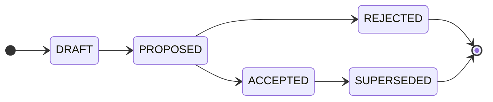

# Contributing

<!-- Agents MUST read ./AGENTS.md. This document is for humans. -->

These contributing guidelines provide step-by-step instructions to pitch technical proposals and shepherd them through the RFC process.

Anyone with write access to this repository may contribute to the technical direction of the project by submitting technical proposals and requesting comments on them.

These contributing guidelines focus on the mechanics and guardrails of the RFC process. See the [documentation](./docs/) for more general guidance on how to get the most out of the RFC process.

> [!NOTE]
> The capitalized words REQUIRED, MUST, MUST NOT, RECOMMENDED, SHOULD, SHOULD NOT, OPTIONAL, and MAY, in the context of this document and this repository's [agent skills](./agents/skills/), are to be interpreted as described in [IETF RFC 2119](https://www.ietf.org/rfc/rfc2119.txt).

## Criteria for RFC-worthy proposals

Not all technical decisions require an RFC. An RFC is a proposal for a _significant_ technical change. Feature implementations that don't require changes to existing design patterns and technology choices, plus bug fixes, documentation tweaks, routine refactors, and other trivial changes, these all can be handled through the normal pull-request workflow on the relevant code repositories.

The general rule of thumb is: if the change will impact multiple stakeholders, then it is significant enough to warrant building consensus on the design _before_ implementation. This is what an RFC is for.

Changes that typically warrant an RFC include:

- Changes to the system architecture and data models, or any other significant deviations from established implementation patterns.

- Changes to the technology stack, production infrastructure, or major dependencies.

- Changes to interfaces — graphical, command-line, or programmatic — or anything with significant downstream impact.

- Changes that may affect service level agreements. For example, changes to the security model that carry performance or availability risks.

- Changes to development or operations tools and lifecycle processes — anything that affects how contributors do their work.

- Noteworthy changes to coding conventions and other technical standards.

## The RFC lifecycle

Each RFC moves through a defined state machine. The current state of an RFC is shown in the document's `Status` field. In addition, to make it easier to search and filter pending technical decisions, corresponding labels are applied to open pull requests: `#proposed`, `#accepted`, etc.

The states are:

- `DRAFT`: The RFC is being written. Its pull request is open as a draft, which means its not yet ready for review.

- `PROPOSED`: The RFC is complete and open for feedback. It is now formally reviewed and negotiated with relevant stakeholders. From this point, the author should not make further material changes to the RFC except in response to reviewer feedback.

- `ACCEPTED`: The proposal has been approved. Before closing the PR, final comments are solicited to confirm there are no outstanding objections, and the RFC document and supporting artifacts are updated to reflect the final agreed design and its rationale. When all stakeholders have signed off on the final wording, the discussion thread is closed and the PR is merged into the `main` branch. The RFC is given a unique number and listed in the [RFC index](./rfc/INDEX.md). An accepted decision remains in effect until a later RFC supersedes it.

- `REJECTED`: The decision will not be taken forward. The discussion thread is closed and the PR is merged into `main`. The rejected RFC is given a unique number and listed in the [RFC index](./rfc/INDEX.md) alongside accepted RFCs. Thus, all major technical decisions, whether ultimately accepted or rejected, are preserved permanently.

- `SUPERSEDED`: The decision, previously accepted, is no longer in effect because it has been replaced by a later RFC.

The state transitions are intended to be simple, memorable, and easy to enforce through automation. The permitted state transitions are as follows:

| From        | To         | Condition                            |
| ----------- | ---------- | ------------------------------------ |
| _(new RFC)_ | DRAFT      | Scaffolding. Proposal being written. |
| DRAFT       | PROPOSED   | RFC complete. Feedback solicited.    |
| PROPOSED    | ACCEPTED   | Final comments concluded. Accepted.  |
| PROPOSED    | REJECTED   | Final comments concluded. Rejected.  |
| ACCEPTED    | SUPERSEDED | Replaced by a newer, accepted RFC.   |

Transitions not listed above are not permitted. In particular, a decision MUST NOT move backwards (eg. from `ACCEPTED` back to `PROPOSED`), and MUST NOT skip states (eg. from `PROPOSED` to `SUPERSEDED`).

> [!TIP]
> This repository includes a suite of [agent skills](./.agents/skills/) that automate the state transitions and enforce the gate rules. It is RECOMMENDED to get AI agents to apply state transitions, by prompting the agents to use these skills. Doing so helps to keep the process consistent.

## The RFC workflow

The RFC process is initialized by a proposal being put forward for comments. The author(s) of proposals are responsible for the full lifecycle thereafter, shepherding their proposals from initial draft to final decision. This process includes building consensus with stakeholders, revising the proposal in response to feedback, and ensuring the final version of the RFC accurately reflects the agreed design and rationale.

Follow these steps…

### Step 1: Write the proposal document

A pull request is the formal vehicle for an RFC. Open it as soon as you are ready to start writing the RFC document – even if only a rough draft.

Follow these steps to prepare the pull request:

1. Branch off `main` using the naming convention `rfc/<slug>`, where `<slug>` is a short, hyphen-delimited description of the proposal, eg. `rfc/event-sourcing-for-audit-log`.

2. Change to the new branch. Copy [`rfc/TEMPLATE.md`](./rfc/TEMPLATE.md) to `rfc/<category>/<slug>/README.md`, where `<category>` is the lowercase category directory: "architecture", "process", "technology", or "tooling".

3. Fill out the template. Each RFC is, at a minimum, a single Markdown document. The template includes placeholder text to guide you on what to include. Refer to other RFCs for examples of how to write up a proposal. You do not need to fill every section of the template — include only what is relevant to the decision at hand. However, be sure to include a convincing motivation for the change, demonstrate an understanding of the impact of the proposed solution, and be honest about its drawbacks and the relative merits of alternative solutions.

4. Add supporting artifacts – OPTIONAL. The RFC lives in its own directory, so you may add architectural diagrams, benchmarks, etc. All supporting artifacts MUST be linked from the RFC's `README.md`. Alternatively, if an artifact cannot live in the RFC repository (eg. a working prototype), it MAY be referenced as an external link. Internal artifacts are preferred, however, as they are less likely to decay and they keep the decision record self-contained.

### Step 2: Open a pull request

1. Commit your changes and open a pull request titled `rfc: <description>`. Initially, the PR SHOULD be a draft. You will mark it ready for review in a later step, once the proposal is complete enough to invite feedback from stakeholders.

2. Apply one category label to the pull request:

  - **ARCHITECTURE**: A decision about system design, structure, or implementation patterns.

  - **PROCESS**: A decision about the development or operations lifecycle — how contributors work.

  - **TECHNOLOGY**: A decision about the production technology stack or infrastructure.

  - **TOOLING**: A decision about the automation tools or devops infrastructure.

3. Open a discussion thread for the RFC. Link to the thread in the `Discussion thread` field of the RFC document. Update the PR description to link to the discussion thread too. Create a bi-directional link from the discussion thread back to the PR.

4. Continue to refine your proposal. OPTIONALLY, you may invite early feedback from a small set of trusted stakeholders while the proposal is still being drafted.

### Step 3: Request comments

1. When your proposal is ready for full stakeholder review, mark the pull request as "ready for review" (removing its draft status) and apply the `#proposed` label.

2. Request comments from a wide group of technical stakeholders. Feedback SHOULD be solicited from everyone who will be impacted by the change, and from anyone with relevant expertise. The more complex and impactful the change, the more important it is to solicit feedback from a wide range of stakeholders.

3. During the RFC process, you should be prepared to build consensus for your idea and to revise your proposal in response to feedback.

4. Once the proposed solution has stabilized, the main points of contention have been resolved, and all stakeholders are aligned on the outcome, request final comments to confirm there are no outstanding objections. The length of the final comment period depends on the complexity and impact of the change, but a good rule of thumb is at least one week.

### Step 4: Merge the RFC

Once the final comment period has concluded, and when there is clear consensus on the outcome, the RFC is ready to be merged.

1. Update the RFC document's `Status` field to `ACCEPTED` or `REJECTED`, as appropriate.

2. Remove the `#proposed` label and apply the `#accepted` or `#rejected` label instead.

3. Review the final version of the RFC document to ensure it accurately reflects the agreed design and rationale. Make any necessary edits to clarify the proposal, but do not change the substance of the decision at this point.

4. Merge the PR. Delete the branch, if it is not automatically deleted.

5. On the `main` branch, update `rfc/INDEX.md` to add the new RFC, with the next sequential number. The number is not assigned until merge, so be sure to check the index for the latest number before updating. Commit this change directly to `main`.

6. Close the discussion thread.

## Rules

- RFCs and supporting artifacts MUST be written in American English.

- RFCs SHOULD be written in a fairly informal style – they are proposals, not specifications.

- There MUST be one main Markdown file, named `README.md`, for each RFC. Any other artifacts in an RFC directory, which may include other Markdown files, diagrams, prototypes, etc., MUST be referenced from the main `README.md`. If it's not referenced from the `README.md`, it's not part of the RFC.

- Each RFC SHOULD be focused on a single atomic decision that can be reviewed, decided, and merged independently of any other. If you have multiple decisions to propose, open multiple pull requests, and link them together as related RFCs.

- Each RFC SHOULD be focused on one of these categories: system architecture, devops process, production technology, or devops tooling.

- The issue tracker MUST NOT be used for managing RFCs. This is reserved for tracking maintenance work on this repository itself.

- Discussion threads SHOULD be used as the forum for discussion. This helps to keep the PR comment thread focused on edits to the RFC artifacts.

- An RFC is the record of a decision. The [`rfc/`](./rfc/) directory is an append-only log. Once an RFC's `Status` is `ACCEPTED` or `REJECTED`, its document is immutable; only its `Status` field, `Last updated` date, cross-references to related RFCs, and implementation trackers may change thereafter, to reflect the current state of the decision and its changing relationship to other decisions. Users and agents MUST NOT edit other details of an `ACCEPTED` or `REJECTED` RFC, especially the description of the problem, the settled solution, and its rationale.

- You MUST NOT delete any RFC documents in the `main` branch, including `REJECTED` RFCs. To change a past decision, open a new RFC that supersedes it. This constraint ensures that a record of every past decision, including `REJECTED` and `SUPERSEDED` ones, is preserved indefinitely. This is critical for maintaining institutional memory. Future contributors to the project can refer to the history of past decisions to understand the rationale for the current state of the system.

- RFCs MUST NOT be merged to `main` before they are decided – either `ACCEPTED` or `REJECTED`. RFCs that are still being refined or negotiated live on their own `rfc/` branches and have open pull requests.

- RFC branches are squash-merged into `main` once a decision is made. The message of the squash commit on `main` MUST take the form `rfc: <slug> - ACCEPTED|REJECTED`, where `<slug>` is a short description of the proposal, written full lowercase.

## Contributor license agreement

<!-- Delete this for closed source projects. -->

By opening a pull request to this repository, you accept and agree to the following terms and conditions:

- You agree that your contribution may be distributed under the terms of the [CC0 1.0 Universal license](./LICENSE.txt), effectively releasing it to the public domain.

- You certify that your contribution is either created in whole by you and you have the right to distribute it under the designated license, or is based on a previous work with a compatible license that permits distribution and modification under the designated license.

- You understand and agree that your contribution is public and that a record of it, including all personal information you submit with it, is maintained indefinitely and may be redistributed consistent with the designated license.
