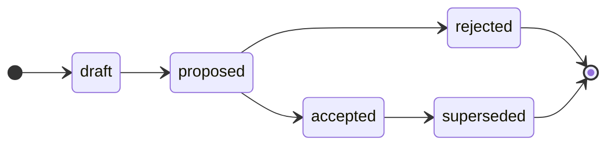

# Contributing

<!-- Agents MUST read ./AGENTS.md. This document is for humans. -->

Anyone with write access to this repository may contribute to the technical direction of this project by submitting technical proposals and requesting comments on them. These contributing guidelines provide step-by-step instructions to pitch technical proposals and shepherd them through the RFC process.

## Rules

The capitalized words REQUIRED, MUST, MUST NOT, RECOMMENDED, SHOULD, SHOULD NOT, OPTIONAL, and MAY, in the context of this document and this repositories [agent skills](./agents/skills/), are to be interpreted as described in [IETF RFC 2119](https://www.ietf.org/rfc/rfc2119.txt).

- MUST write in American English.

- An RFC is the record of a decision. The [`rfc/`](./rfc/) directory is an append-only log. Once an RFC is `ACCEPTED` or `REJECTED`, its document is immutable; only its `Status` field, `Last updated` date, cross-references to related RFCs, and implementation trackers may change thereafter. Users and agents MUST NOT edit other details of an accepted or rejected RFC.

- An RFC MUST be a single, atomic decision. Author it on an `rfc/<slug>` branch cut from `main`, and open a pull request titled `rfc: <slug>`.

- When the pull request is opened, it MUST be labeled with exactly one category — `ARCHITECTURE`, `PROCESS`, `TECHNOLOGY`, or `TOOLING` — matching the area of the decision.

- A draft PR is opened when a new RFC is first opened. Once the proposal is refined sufficiently to invite stakeholder feedback, the author MUST set the PR to "ready for review".

- The lifecycle state of an open RFC is tracked via labels on its PR. You MUST apply the matching label — `#proposed`, `#accepted`, `#rejected`, `#superseded` — as the RFC advances.

- Every RFC pull request MUST have an associated discussion thread for review feedback, opened with the PR and closed when the RFC is accepted or rejected.

- You MUST NOT delete any RFC documents in the `main` branch, including rejected RFCs. To change a past decision, open a new RFC that supersedes it — do NOT edit the original except to update its `Status` field, `Last updated` date, cross-references to related RFCs, and implementation trackers.

- The issue tracker is for maintenance work on this repository only (the `MAINTENANCE` template). RFCs are managed entirely through pull requests.

## Branch conventions

The default branch of this repository is `main`. The [`rfc/`](./rfc/) directory on `main` is the permanent, append-only archive of every major technical decision — all accepted and rejected ideas. An RFC is merged into `main` only once it has been _decided_, ie. its status is `ACCEPTED` or `REJECTED`. RFCs that are still being refined or negotiated live on their own branches (as open pull requests) and are not merged.

All RFC branches are cut from `main` and merged back into `main`. See the lifecycle section below for the conditions that must be met before an RFC is merged.

## Commit conventions

Every commit on an RFC branch is prefixed `rfc:`, matching the branch name (`rfc/<slug>`) and the pull request title (`rfc: <slug>`). Use the message shown for each lifecycle step below. The [skills](#skills) write these for you; follow the same convention when working by hand, so the history reads identically whether a human or an agent drove the change.

| Step | Commit message |
| --- | --- |
| Scaffold a new RFC | `rfc: <slug>` |
| Link the discussion thread | `rfc: link discussion thread for <slug>` |
| Mark ready for review (draft → proposed) | `rfc: mark <slug> ready for review` |
| Accept (proposed → accepted) | `rfc: accept <slug> (RFC <NNNN>)` |
| Reject (proposed → rejected) | `rfc: reject <slug> (RFC <NNNN>)` |
| Supersede (accepted → superseded) | `rfc: supersede <slug>` |

`<NNNN>` is the four-digit RFC number assigned in [`INDEX.md`](./rfc/INDEX.md) at merge — the highest existing number plus one, zero-padded (eg. `0007`).

## Proposing a decision

<!--

The RFC process is initialized by a proposal being put forward for comments – literally, a request for comments.

There is one main document per proposal – a Markdown file – and each proposal is generally scoped to a single technical decision.

-->

### Step 1: Open a discussion thread (REQUIRED)

Every RFC has an associated **discussion thread**, and it is where _all_ review feedback is gathered — not the pull request's own comments. This keeps the pull request focused on the evolution of the RFC document itself.

Open a [discussion](https://github.com/[username]/rfc/discussions) using the form for the RFC's category. You MAY open it early, to brainstorm before a firm proposal exists, but it MUST exist by the time the pull request is opened (even a draft PR). Link the discussion and the pull request to each other. The thread stays open for the life of the proposal and is closed once the RFC is accepted or rejected.

> [!NOTE]
> The four category discussion forms in [`.github/DISCUSSION_TEMPLATE/`](./.github/DISCUSSION_TEMPLATE/) — `architecture`, `process`, `technology`, and `tooling` — only define the _forms_; they do not create anything on their own. A one-time manual setup is required in the repository settings: enable **Discussions** (Settings → General → Features), then create a Discussions category for each form, named so its slug matches the form's filename (for example, an **Architecture** category for `architecture.yml`). A form takes effect only once its matching category exists.

(The GitHub issue tracker is _not_ used for RFCs — it is reserved for maintenance work on this repository itself.)

### Step 2: Open a pull request (REQUIRED to progress an RFC)

A pull request is the formal vehicle for an RFC. Open it as soon as you are ready to start writing the RFC document; its associated discussion thread (step 1) MUST exist by this point.

Every RFC has exactly one category:

- **ARCHITECTURE**: A decision about system design, structure, or implementation patterns.

- **PROCESS**: A decision about the development or operations lifecycle — how contributors work.

- **TECHNOLOGY**: A decision about the production technology stack or infrastructure.

- **TOOLING**: A decision about the automation tools or devops infrastructure.

Follow these steps to prepare the pull request:

1. Branch off `main` using the naming convention `rfc/<slug>`, where `<slug>` is a short, hyphen-delimited description of the decision. For example, `rfc/event-sourcing-for-audit-log`.

2. Copy [`rfc/TEMPLATE.md`](./rfc/TEMPLATE.md) to `rfc/<category>/<slug>/README.md`, where `<category>` is the lowercase category directory (`architecture`, `process`, `technology`, or `tooling`). The RFC lives in its own directory, so you may add supporting artifacts — architectural diagrams, prototypes, benchmarks, and the like — alongside the `README.md` and link them from its `References` section. Keeping such artifacts in the RFC directory is preferred, as it keeps the record self-contained; link to an external repository only where an artifact cannot live here. Fill it out: link the associated discussion thread (step 1) via the `Discussion thread` field, and describe the decision in full — the motivation, the proposed solution, the alternatives considered, and the trade-offs.

<!--

Proposals should present a convincing motivation for the change, demonstrate an understanding of the impact of the proposed solution, and be honest about its drawbacks and the relative merits of alternative solutions.

You do not need to include all sections of the template; just include what is relevant to the problem and solution at hand.

Proposals should be written in an informal style (they are not specifications or standards) and they may leave questions open for discussion.

Other artifacts such as architectural diagrams may be linked from or embedded in proposal documents.

-->

3. Commit your changes and open a pull request titled `rfc: <slug>`. Each pull request MUST be focused on a single atomic decision that can be reviewed, decided, and merged independently of any other. If you have multiple decisions to propose, open multiple pull requests.

4. Apply one category label to the pull request — `ARCHITECTURE`, `PROCESS`, `TECHNOLOGY`, or `TOOLING` — matching the kind of decision. Exactly one category label is REQUIRED on every RFC pull request.

Open the pull request as a GitHub draft; at this point it carries only its category label. Keep it in draft while you refine the document. When it is ready for full stakeholder review, mark the pull request as "ready for review" and apply the `#proposed` label.

> [!TIP]
> You don't have to do this by hand: [`/draft-rfc`](./.agents/skills/draft-rfc/) scaffolds the document, opens the draft pull request, applies the category label, and opens the associated discussion thread; [`/propose-rfc`](./.agents/skills/propose-rfc/) then marks the PR ready for review once it is complete. See [Skills](#skills) below.

<!--

The Technical Leads will review your proposal and provide feedback. If they agree the idea should be explored in more detail, they will request comments from other technical stakeholders. This is all done via the discussion thread, which means the comment thread on the PR itself stays focused on the evolution of the RFC documents themselves.

During this phase, you should be prepared to build consensus for your idea among the technical stakeholders, and to revise your proposal in response to feedback.

Once discussion has resolved the main points of contention, and once the proposed solution has stabilized, the Technical Leads will provisionally mark the proposal as "accepted" or "rejected" and invite final comments. The final comment period lasts for at least two weeks.

The outcome of the RFC process will be for your proposal document to be merged into the `main` branch of the upstream reference repository. All proposals are merged, whether they are ultimately accepted or rejected. On merging, the Technical Leads will make final edits to your proposal document, giving it a unique numerical ID and changing the document's status to `ACCEPTED` or `REJECTED`, depending on the final outcome.

When a proposal is accepted, it is said to be pending implementation, and the Technical Leads will open tickets in the application repositories to track the implementation. Those tickets will be linked from the original proposal document, and vice versa. - eg. if technical spikes required before a final decision is made.

During development, the design of a solution may be further iterated from the original proposal. Therefore accepted proposals will continue to be edited (either by the Technical Leads or the people assigned to the implementation) to reflect the evolving design. Once the implementation is done (which means: shipped to production), the contents of the original document will be updated to reflect the final design.

Thereafter, the proposal document will be treated as immutable. Thus, to change or revert past decisions that have been already implemented, new proposals must be put forward that supersede the original ones. The status of the original decisions will be changed to `DEPRECATED` and the relevant documents will be updated to cross-reference each other.

----
Supersedes: RFC 0123
Superseded by: RFC 0321
----

'''''''''''''''''''''''''''''''''''''''''''

Proposals are negotiated with the relevant project stakeholders. During the RFC process, the original proposal may change, perhaps significantly, in response to stakeholder feedback. When the proposal is finalized, the original proposal document is be updated to describe the settled solution, the design rationale for it, and the relative pros and cons of any alternative solutions that were considered.

The outcome of the RFC process is for the finalized proposal to be either accepted or rejected.

When a proposal is accepted, it is queued for implementation. Tasks will be created in the relevant project management tools to track the implementation.

Once a proposal reaches the accepted or rejected state, the contents of the proposal document are treated as immutable. Only the status of the document may change thereafter. This constraint ensures that records of all past decisions – even those that are no longer in effect – are persisted indefinitely. To change past decisions, new RFCs are introduced that extend or supersede prior ones.

-->

## RFC lifecycle

Each RFC moves through a defined state machine. From `proposed` onward, the current state is shown by a lifecycle label on the pull request; before that, the RFC is simply an open draft pull request. The states are:

- **Draft**: The RFC is being written. Its pull request is open as a GitHub draft and carries only its category label — there is no `#draft` label; "draft" is the pull request's own draft flag. The RFC is not yet ready for review.

- **Proposed**: The RFC is complete and open for a decision. The proposer has marked the pull request ready for review, and it is labeled `#proposed`. It is now formally reviewed and negotiated with the relevant stakeholders; from this point, the author should not make further material changes to the document, unless changes are requested by reviewers.

- **Accepted**: The decision has been approved. Before accepting, the maintainers confirm that stakeholder review has concluded, a final-comment period has elapsed with no material change to the document, and every RFC listed under `Depends on` is itself accepted. They then record the RFC's number in [`INDEX.md`](./rfc/INDEX.md), close the associated discussion thread, merge the RFC into `main`, and queue any work necessary for implementation. An accepted decision remains in effect until a later RFC supersedes it.

- **Rejected**: The decision will not be taken forward. The maintainers record the RFC's number in [`INDEX.md`](./rfc/INDEX.md), close the associated discussion thread, then merge the RFC document into `main`, where it is preserved permanently in [`rfc/`](./rfc/) as the record of the decision and its rationale.

- **Superseded**: A previously accepted decision that is no longer in effect, because a later RFC has replaced it. This is the only state an accepted RFC can progress to.

<!--

Each RFC proposal has one of the following possible states, representing the stage that the proposal is at in the decision-making process:

- **Draft**: A preliminary version of a proposal, put forward for early feedback.
- **Proposed**: A proposal that is being negotiated with the relevant stakeholders.
- **Accepted**: A proposal that has been approved and is currently pending implementation.
- **Rejected**: A proposal that has been rejected and will not be taken forward.
- **Implemented**: A proposal that has been implemented and is currently in effect.
- **Deprecated**: A legacy proposal that was previously implemented but has since been superseded by more recent changes and is no longer in effect.

-->

### Permitted transitions

The proposer drives an RFC up to `proposed` — drafting it, then marking the pull request ready for review. Only the maintainers may take the decision transitions: `accepted`, `rejected`, and `superseded`. Each transition has its own skill (see [Skills](#skills)) that verifies the gates for that transition and applies the matching label.

| From | To | Skill | Condition |
| --- | --- | --- | --- |
| _(new RFC)_ | `draft` | [`/draft-rfc`](./.agents/skills/draft-rfc/) | A draft pull request is opened with the scaffolded document and a category label. |
| `draft` | `proposed` | [`/propose-rfc`](./.agents/skills/propose-rfc/) | Document complete and free of template boilerplate; PR marked ready for review and labeled `#proposed`. |
| `proposed` | `accepted` | [`/approve-rfc`](./.agents/skills/approve-rfc/) | Stakeholder review and final-comment period concluded; `Depends on` RFCs accepted; decision approved; number added to `INDEX.md`; discussion closed; merged. |
| `proposed` | `rejected` | [`/reject-rfc`](./.agents/skills/reject-rfc/) | Stakeholder review concluded; decision not approved; number added to `INDEX.md`; discussion closed; merged as record. |
| `accepted` | `superseded` | [`/supersede-rfc`](./.agents/skills/supersede-rfc/) | A later, accepted RFC has replaced this decision, with reciprocal `Supersedes` / `Superseded by` links. |

Transitions not listed above are not permitted. In particular: a decision MUST NOT move backwards (eg. from accepted back to proposed), and a decision MUST NOT skip states (eg. from proposed directly to superseded).

### Immutability

Once an RFC is accepted or rejected, its document is treated as immutable. Only its `Status` field, `Last updated` date, cross-references to related RFCs, and implementation trackers MAY be updated as necessary.

To revisit a past decision, open a new RFC that supersedes the original and cross-reference the two using the `Supersedes` / `Superseded by` fields.

This constraint ensures that a record of every past decision, including rejected and superseded ones, is preserved indefinitely. This is critical for maintaining institutional memory. Future contributors and maintainers of the project can refer to the history of past decisions to understand the rationale for the current state of the system.

## Skills

This repository ships a small set of **agent skills** — invoked as slash commands through agentic tools such as Claude Code — that automate the RFC workflow. They live in [`.agents/skills/`](./.agents/skills/), with **one skill per state transition**. Each skill knows the gate rules for its own transition and will not proceed until they are met, which keeps the process consistent whether a human or an agent is driving it. You can always perform any step by hand instead; the skills simply encode the conventions described above.

The skills, in lifecycle order:

- **[`/draft-rfc`](./.agents/skills/draft-rfc/)** — _start a new RFC_. Scaffolds the branch and document from the template, opens a draft pull request with one category label applied, and opens the associated discussion thread — ready for you to complete.

- **[`/propose-rfc`](./.agents/skills/propose-rfc/)** — _draft → proposed_. Confirms the document is complete and free of leftover template text, applies the `#proposed` label, and takes the pull request out of draft so stakeholders can review it.

- **[`/approve-rfc`](./.agents/skills/approve-rfc/)** — _proposed → accepted_. Verifies the approval gates, records the next number in `INDEX.md`, sets the document to `ACCEPTED`, labels the pull request `#accepted`, closes the discussion thread, and prepares it for merge.

- **[`/reject-rfc`](./.agents/skills/reject-rfc/)** — _proposed → rejected_. Records the rejection: adds the next number in `INDEX.md`, sets the document to `REJECTED`, labels the pull request `#rejected`, closes the discussion thread, and prepares it for merge as a permanent record.

- **[`/supersede-rfc`](./.agents/skills/supersede-rfc/)** — _accepted → superseded_. Marks an accepted RFC `#superseded` once a later, accepted RFC has replaced it, and cross-links the two.

A typical journey runs `/draft-rfc` → _(write the proposal)_ → `/propose-rfc` → _(stakeholder review)_ → `/approve-rfc` or `/reject-rfc`. Much later, `/supersede-rfc` retires a decision that a newer RFC has replaced.

Each skill's directory holds a `README.md` (how to invoke it, with examples) and a `SKILL.md` (the full instructions and transition rules).

<!--

## Contributor license agreement

By opening a pull request to this repository, you accept and agree to the following terms and conditions:

- You agree that your contribution may be distributed under the terms of the [Creative Commons Attribution 4.0 International License](https://creativecommons.org/licenses/by/4.0/). .... change to CC0 - which basically means the contribution is released to the public domain.

- You certify that your contribution is either created in whole by you and you have the right to distribute the work under the designated license, or is based on a previous work with a similar license that permits distribution and modification under the designated license.

- You understand and agree that your contribution is public and that a record of the contribution, including all personal information that you submit with it, is maintained indefinitely and may be redistributed as per the requirements of the designated license.

-->
