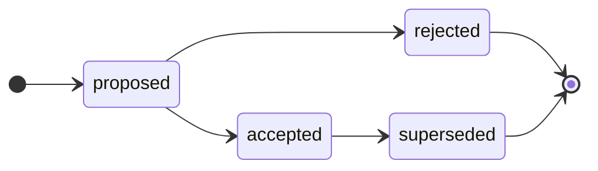

# Contributing

<!-- Agents MUST read ./AGENTS.md. This document is for humans. -->

Anyone with write access to this repository may propose a technical decision by opening an RFC. The project maintainers are responsible for shepherding RFCs through their lifecycle and for keeping the archive in good order.

## Rules

The capitalized words REQUIRED, MUST, MUST NOT, RECOMMENDED, SHOULD, SHOULD NOT, OPTIONAL, and MAY, in the context of this document and agent skills, are to be interpreted as described in [RFC 2119](https://www.ietf.org/rfc/rfc2119.txt).

- Write in American English.

- An RFC is the record of a decision. The [`rfcs/`](./rfcs/) directory is an append-only log. Once an RFC is `ACCEPTED` or `REJECTED`, its document is immutable; only its `Status` field, `Last updated` date, cross-references to related RFCs, and implementation trackers may change thereafter.

- An RFC MUST be a single, atomic decision. Author it on an `rfc/[slug]` branch cut from `main`, and open a pull request titled `rfc: [slug]`.

- When the pull request is opened, it MUST be labeled with exactly one category — `ARCHITECTURE`, `PROCESS`, `TECHNOLOGY`, or `TOOLING` — matching the kind of decision. The category is denoted solely by this label; it is not duplicated in the RFC document.

- The current lifecycle state of an RFC is tracked via a lifecycle label on the PR. Apply the matching label — `#proposed`, `#accepted`, `#rejected`, `#superseded` — as the RFC advances. A PR is opened as a GitHub draft while the document is still being refined; the author marks it ready for review when it is ready for stakeholder review.

- Never delete an RFC document, including rejected ones. To change a past decision, open a new RFC that supersedes it — do NOT edit the original except to update its `Status` field, `Last updated` date, cross-references to related RFCs, and implementation trackers.

- The issue tracker is for maintenance work on this repository only (the `MAINTENANCE` template). RFCs are managed entirely through pull requests; open a discussion for early, open-ended feedback.

## Branch conventions

The default branch of this repository is `main`. The [`rfcs/`](./rfcs/) directory on `main` is the permanent, append-only archive of every major technical decision — all accepted and rejected ideas. An RFC is merged into `main` only once it has been _decided_, ie. its status is `ACCEPTED` or `REJECTED`. RFCs that are still being refined or negotiated live on their own branches (as open pull requests) and are not merged.

All RFC branches are cut from `main` and merged back into `main`. See the lifecycle section below for the conditions that must be met before an RFC is merged.

## Proposing a decision

### Step 1: Open a discussion (OPTIONAL)

If an idea needs early, open-ended feedback before a firm proposal can be written, the proposer MAY open a [discussion](https://github.com/[username]/rfc/discussions).

Discussion threads are well-suited to early brainstorming and to gauging whether an idea is worth progressing, without committing to a full RFC.

The GitHub issue tracker is _not_ used for RFCs — it is reserved for maintenance work on this repository itself. RFCs are proposed and decided entirely through pull requests.

### Step 2: Open a pull request (REQUIRED to progress an RFC)

A pull request is the formal vehicle for an RFC. It MAY be opened at any point — with or without a prior discussion — as soon as the proposer is ready to write the full RFC document.

Every RFC has exactly one category:

- **ARCHITECTURE**: A decision about system design, structure, or implementation patterns.

- **PROCESS**: A decision about the development or operations lifecycle — how contributors work.

- **TECHNOLOGY**: A decision about the production technology stack or infrastructure.

- **TOOLING**: A decision about the automation tools and devops infrastructure.

Follow these steps to prepare the pull request:

1. Branch off `main` using the naming convention `rfc/[slug]`, where `[slug]` is a short, hyphen-delimited description of the decision. For example, `rfc/event-sourcing-for-audit-log`.

2. Copy [`rfcs/TEMPLATE.md`](./rfcs/TEMPLATE.md) to `rfcs/[slug].md` and fill it out. If a discussion was opened, link back to it via the `Discussion thread` field. Describe the decision in full: the motivation, the proposed solution, the alternatives considered, and the trade-offs.

3. Commit your changes and open a pull request titled `rfc: [slug]`. Each pull request MUST be focused on a single atomic decision that can be reviewed, decided, and merged independently of any other. If you have multiple decisions to propose, open multiple pull requests.

4. Apply one category label to the pull request — `ARCHITECTURE`, `PROCESS`, `TECHNOLOGY`, or `TOOLING` — matching the kind of decision. Exactly one category label is REQUIRED on every RFC pull request.

Open the pull request as a GitHub draft and apply the `#proposed` label. Keep it in draft while you refine the document; mark it ready for review once it is ready for full stakeholder review.

## RFC lifecycle

Each RFC moves through a defined state machine. The current state is represented by a lifecycle label on the pull request. The states are:

- **Proposed**: The RFC is open and awaiting a decision. The pull request is opened as a GitHub draft while the proposer refines the document; once they mark it ready for review, it is formally reviewed and negotiated with the relevant stakeholders. From that point, the author should not make further material changes to the document, unless changes are requested by reviewers.

- **Accepted**: The decision has been approved. The maintainers assign a sequential ID, merge the RFC into `main`, and queue any work necessary for implementation. An accepted decision remains in effect until a later RFC supersedes it.

- **Rejected**: The decision will not be taken forward. The RFC document is merged into `main` and preserved permanently in [`rfcs/`](./rfcs/) as the record of the decision and its rationale.

- **Superseded**: A previously accepted decision that is no longer in effect, because a later RFC has replaced it. This is the only state an accepted RFC can progress to.

### Permitted transitions

Only the maintainers may advance an RFC's state. They verify the gates using the PR's checklist and apply the matching label — `#proposed`, `#accepted`, `#rejected`, or `#superseded` — as each transition occurs.

| From | To | Condition |
| --- | --- | --- |
| _(new PR)_ | `proposed` | PR opened (as a draft PR) for a new RFC. |
| `proposed` | `accepted` | Stakeholder review concluded; decision approved; ID assigned; merged. |
| `proposed` | `rejected` | Stakeholder review concluded; decision not approved; merged as record. |
| `accepted` | `superseded` | A later RFC has replaced this decision. |

Transitions not listed above are not permitted. In particular: a decision MUST NOT move backwards (eg. from accepted back to proposed), and a decision MUST NOT skip states (eg. from proposed directly to superseded).

### Immutability

Once an RFC is accepted or rejected, its document is treated as immutable. Only its `Status` field, `Last updated` date, cross-references to related RFCs, and implementation trackers MAY be updated as necessary.

To revisit a past decision, open a new RFC that supersedes the original and cross-reference the two using the `Supersedes` / `Superseded by` fields.

This constraint ensures that a record of every past decision, including rejected and superseded ones, is preserved indefinitely. This is critical for maintaining institutional memory. Future contributors and maintainers of the project can refer to the history of past decisions to understand the rationale for the current state of the system.
