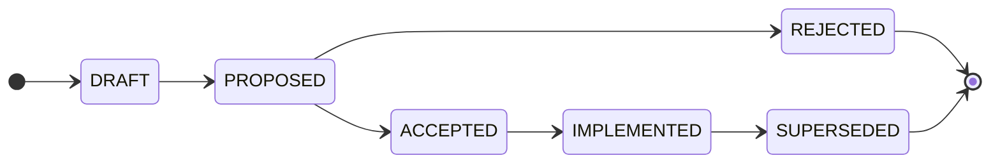

# Contributing

<!-- Agents MUST read ./AGENTS.md. This document is for humans. -->

These contributing guidelines provide step-by-step instructions to pitch
technical proposals and shepherd them through the RFC process.

The focus here is on the mechanics and guardrails of the RFC process. See the
[documentation](./docs/) for more general guidance on how to get the most
out of the RFC process.

Anyone with write access to this repository may contribute to the technical
direction of the project by submitting technical proposals and requesting
comments on them.

See also [TS-3](https://kieranpotts.com/standards/003)
for the technical standard that underpins this process.

****
The capitalized words REQUIRED, MUST, MUST NOT, RECOMMENDED, SHOULD,
SHOULD NOT, OPTIONAL, and MAY herein are to be interpreted as described
in [IETF RFC 2119](https://www.ietf.org/rfc/rfc2119.txt).
****

## Lifecycle

Each RFC moves through a defined state machine. The current state of an RFC is
shown in the document's `Status` field. In addition, to make it easier to search
and filter pending technical decisions, corresponding labels are applied to open
pull requests: `#proposed`, `#accepted`, etc.

The states are:

- `DRAFT`: The RFC is being written.

- `PROPOSED`: The RFC is complete and open for feedback, formally reviewed and
  negotiated with relevant stakeholders.

- `ACCEPTED`: The proposal has been approved, and the RFC document and
  supporting artifacts are updated to reflect the final agreed design and its
  rationale.

- `IMPLEMENTED`: All the changes to tooling and infrastructure that the decision
  calls for are now in place.

- `REJECTED`: The proposal will not be taken forward.

- `SUPERSEDED`: The decision, previously implemented, is no longer in effect
  because it has been replaced by a later RFC.

The following state transitions are permitted. They are intended to be simple,
memorable, and easy to enforce through automation and agentic workflows.


```mermaid
stateDiagram-v2
  direction LR
  [*] --> DRAFT
  DRAFT --> PROPOSED
  PROPOSED --> ACCEPTED
  PROPOSED --> REJECTED
  ACCEPTED --> IMPLEMENTED
  IMPLEMENTED --> SUPERSEDED
  REJECTED --> [*]
  SUPERSEDED --> [*]
```

| From         | To          | Condition                              |
| ------------ | ----------- | -------------------------------------- |
| _(new RFC)_  | DRAFT       | Scaffolding. Proposal being written.   |
| DRAFT        | PROPOSED    | RFC complete. Feedback solicited.      |
| PROPOSED     | ACCEPTED    | Final comments concluded. Accepted.    |
| PROPOSED     | REJECTED    | Final comments concluded. Rejected.    |
| ACCEPTED     | IMPLEMENTED | Tooling and infrastructure in place.   |
| IMPLEMENTED  | SUPERSEDED  | Replaced by a newer, implemented RFC.  |

Transitions not listed above are not permitted. An RFC MUST NOT move
backwards and MUST NOT skip states.

## Workflow

> [!TIP]
> [Agent skills](./.agents/skills/) are available to help automate some steps in
> this workflow. It is RECOMMENDED to use agents to drive state transitions.
> Doing so helps to maintain consistency.

The RFC process is initialized by a proposal being put forward for comments. The
author(s) of proposals are responsible for the full lifecycle thereafter,
shepherding their proposals from initial draft to final decision. This process
includes building consensus with stakeholders, revising the proposal in response
to feedback, and ensuring the final version of the RFC accurately reflects the
agreed design and rationale.

1.  Branch off `main` using the naming convention `rfc/<slug>`, where `<slug>`
    is a short, hyphen-delimited description of the proposal, eg.
    `rfc/event-sourcing-for-audit-log`.

2.  Change to the new branch. Copy the [template](./rfc/TEMPLATE.md) to
    `rfc/<category>/<slug>/README.md`, where `<category>` is the lowercase
    category directory: "architecture", "process", "technology", or "tooling".

3.  Fill out the template – even if only a rough draft, to start. Refer to other
    RFCs for examples.

4.  Add supporting artifacts – OPTIONAL. The RFC lives in its own directory, so
    you may add architectural diagrams, benchmarks, etc.

5.  Commit your changes and open a pull request titled `create: <description>`,
    initially as a draft. Apply one category label to the pull request:

    - `ARCHITECTURE`: A decision about system design, structure, or
      implementation patterns.

    - `PROCESS`: A decision about the development or operations lifecycle – how
      contributors work.

    - `TECHNOLOGY`: A decision about the production technology stack or
      infrastructure.

    - `TOOLING`: A decision about use of automation tools or devops
      infrastructure.

6.  Continue to refine your proposal. OPTIONALLY, invite early feedback from a
    small set of trusted stakeholders while still drafting.

7.  Open an associated discussion thread for the RFC, and link it to the PR and
    to the RFC document's `Discussion thread` field.

8.  When your proposal is ready for review, mark the pull request as "ready for
    review" (removing its draft status) and apply the `#proposed` label.

9.  Request comments from a wide group of technical stakeholders.

10. Build consensus for your idea and revise your proposal in response to
    feedback.

11. Once the proposed solution has stabilized and all stakeholders are aligned
    on the outcome, request final comments to confirm there are no outstanding
    objections.

12. Once the final comment period has concluded, and when there is clear
    consensus on the outcome, decide the RFC – either accepted or rejected.
    Update the RFC document's `Status` field to `ACCEPTED` or `REJECTED`, as
    appropriate, and remove the `#proposed` label, applying `#accepted` or
    `#rejected` instead. The workflow diverges here, depending on the outcome:

    - If rejected, squash-merge the PR straight away (its message takes the
      form `update: <description> - REJECTED`) and delete the branch. Skip to
      the final step to assign its number.

    - If accepted, keep the PR open while any work necessary to implement
      the proposal is undertaken. Open other issues against other repositories
      as necessary to track the implementation, and cross-reference those from
      the `Implementation trackers` section of the RFC's README.

13. For accepted RFCs only: once the tooling and infrastructure the decision
    calls for are in place, update the RFC document's `Status` field to
    `IMPLEMENTED`, and confirm the implementation trackers are linked. Remove
    the `#accepted` label and apply the `#implemented` label instead.
    Squash-merge the PR (its message takes the form
    `update: <description> - IMPLEMENTED`). Delete the branch, if it is
    not automatically deleted.

14. Once a decided RFC has been merged into `main`, update the
    [RFC index](./rfc/INDEX.md) to add the new RFC, with the next sequential
    number. Commit this change directly to `main`.

## Rules

- Not all technical decisions require an RFC. An RFC is a proposal for a
  _significant_ technical change; trivial changes – bug fixes, documentation
  tweaks, routine refactors – MAY be handled through the normal pull-request
  workflow on the relevant code repositories instead. As a rule of thumb, a
  change that will impact multiple technical stakeholders SHOULD go through an
  RFC to build consensus before implementation.

- Changes that typically warrant an RFC SHOULD include:

  - Changes to the system architecture and data models, or any other
    significant deviations from established implementation patterns.

  - Changes to the technology stack, production infrastructure, or major
    dependencies.

  - Changes to interfaces – graphical, command-line, or programmatic – or
    anything with significant downstream impact.

  - Changes that may affect service level agreements, for example changes to
    the security model that carry performance or availability risks.

  - Changes to development or operations tools and lifecycle processes, or
    anything else that will affect how contributors do their work.

  - Noteworthy changes to coding conventions and other technical standards.

- All artifacts MUST be written in American English.

- RFCs SHOULD be written in a fairly informal style – they are proposals, not
  specifications.

- Each RFC MUST have one main Markdown file, named `README.md`. Other artifacts
  in the directory MUST be referenced from it – if it's not referenced, it's
  not part of the RFC.

- Each RFC SHOULD be focused on a single atomic decision that can be reviewed,
  decided, and merged independently of any other. For a chain of interdependent
  proposals, open multiple pull requests and link them as related RFCs.

- Each RFC SHOULD be focused on one of these categories: system architecture,
  devops process, production technology, or devops tooling.

- Discussion threads SHOULD be used as the forum for discussion, to keep the PR
  comment thread focused on edits to the RFC artifacts.

- Once an RFC is `PROPOSED`, the author SHOULD NOT make further material
  changes to it except in response to reviewer feedback.

- The [`rfc/`](./rfc/) directory MUST be treated as an append-only log. Once an
  RFC is merged into `main`, its document is immutable – only the `Status`
  field, `Last updated` date, cross-references, and implementation trackers MAY
  change thereafter. Users and agents MUST NOT edit other details of a merged
  RFC, especially the problem, the settled solution, and its rationale.

- RFC documents in the `main` branch, including `REJECTED` ones, MUST NOT be
  deleted. To change a past decision, open a new RFC that supersedes it – this
  preserves institutional memory of every past decision.

- The issue tracker MUST NOT be used for managing RFCs; it is reserved for
  maintenance work on this repository itself.

## Tools

### Pre-commit hooks

It is RECOMMENDED to install the [pre-commit](https://pre-commit.com) framework
to enable local validation hooks before committing. You need only to run the
following command once to install pre-commit system-wide:

```bash
pipx install pre-commit
```

Then install the pre-commit hooks in every local repository where you want
pre-commit checks to be run:

```bash
pre-commit install
```

This installs all hook types declared in `.pre-commit-config.yaml`
(`pre-commit`, `commit-msg`).

Edit `./.pre-commit-config.yaml` to configure the pre-commit validation checks
you want for your project. See the [pre-commit](https://pre-commit.com) docs for
details.

## Contributor license agreement

<!-- Delete this for closed source projects. -->

By opening a pull request to this repository, you accept and agree to the
following terms and conditions:

- You agree that your contribution may be distributed under the terms of the
  [CC0 1.0 Universal license](./LICENSE.txt), effectively releasing it to the
  public domain.

- You certify that your contribution is either created in whole by you and you
  have the right to distribute it under the designated license, or is based on a
  previous work with a compatible license that permits distribution and
  modification under the designated license.

- You understand and agree that your contribution is public and that a record of
  it, including all personal information you submit with it, is maintained
  indefinitely and may be redistributed consistent with the designated license.
